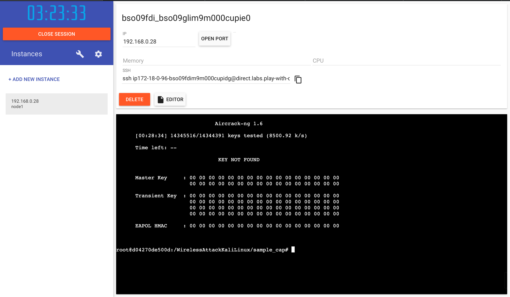

# WirelessAttackKaliLinux

This is only for learning porpouses. 

This probably will not work, but I just like to add the most frequently command used to get the .cap file.

Also, the idea is use docker containers to crack the password faster then just a single core doing the computational stuff.

let's see what happens here...

--- 

## Using DockerPlayground

The performance was good, in 28 minutes the instance tested a bit more than 14 million keys. (8500 keys/second)



```
docker pull kalilinux/kali-rolling
docker run -t -i kalilinux/kali-rolling /bin/bash
apt-get update && apt-get install aircrack-ng
wget https://www.scrapmaker.com/data/wordlists/dictionaries/rockyou.txt
aircrack-ng -w rockyou.txt *.cap
```
